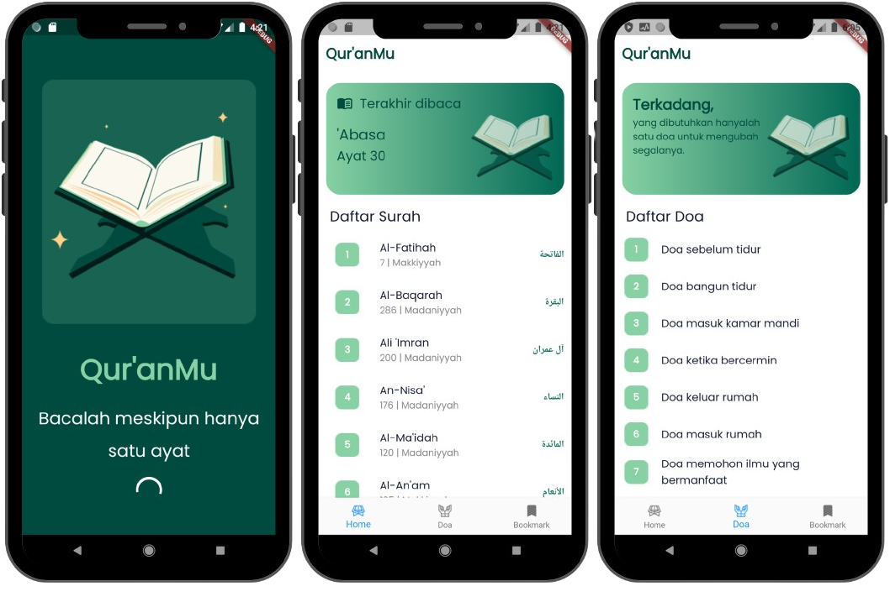

# Qur'anku App

The Qur'anku App is a software designed to facilitate users in reading, memorizing, and studying the Quran, the holy book of Islam. This application is available on mobile platforms such as smartphones and tablets.


## Installation

Install quran with flutter

```bash
git clone https://github.com/taufiq-azr/quran.git
cd quran
flutter pub get
flutter run
```

## 🔗 API Information

API Used: https://api.quran.gading.dev/
    
## Screenshots

{:width="180px"}


## Authors

- [@octokatherine](https://github.com/taufiq-azr)

