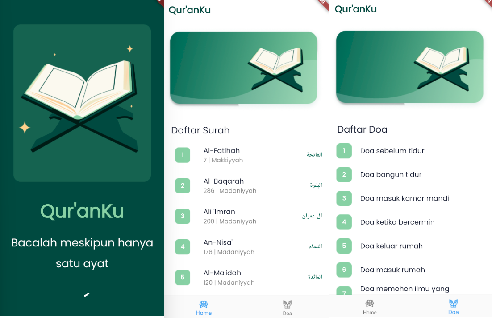
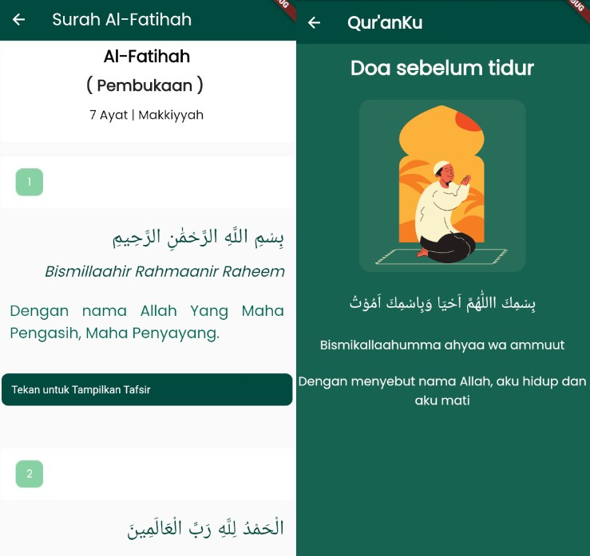

# Qur'anku App

The Qur'anku App is a software designed to facilitate users in reading, memorizing, and studying the Quran, the holy book of Islam. This application is available on mobile android platforms such as smartphones


## Installation

Install quran with flutter

```bash
git clone https://github.com/taufiq-azr/quranku.git
cd quranku
flutter clean
flutter pub get
flutter run
```

## 🔗 API Information

API Used: 
- https://api.quran.gading.dev/
- https://doa-doa-api-ahmadramadhan.fly.dev/api
    
## Screenshots


##



## Authors

- [@taufiq-azr](https://github.com/taufiq-azr)

If you found this project helpful or you learned something from the source code and want to thank me, consider buying me a cup of ☕

- [@paypal](https://www.paypal.com/paypalme/taufiqalazhar)
